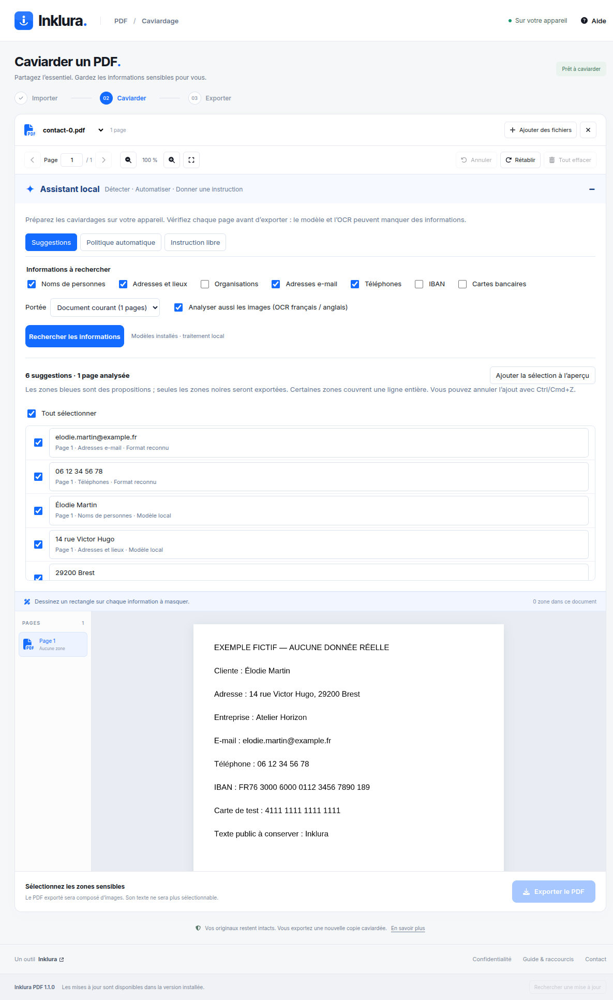

<p align="center">
  
</p>

<h1 align="center">Inklura PDF</h1>

<p align="center">Private PDF redaction, with an optional local AI assistant.<br />Windows · macOS · Linux · Free · No account</p>

<p align="center">
  <a href="https://outils.inklura.fr/inklura-pdf"><strong>Download Inklura PDF</strong></a> ·
  <a href="GUIDE.fr.md">Guide en français</a> ·
  <a href="https://github.com/benfavre/caviard/releases">Release notes</a> ·
  <a href="https://outils.inklura.fr/inklura-pdf#exemples">Example PDFs</a>
</p>

<p align="center">
  <strong>Sponsored by</strong><br />
  <a href="https://www.webdesign29.net/">Webdesign29</a> ·
  <a href="https://www.inklura.fr/">Inklura</a> ·
  <a href="https://www.activ-communication.com/">ACTIV communication</a>
</p>

Inklura PDF helps you remove sensitive information before sharing a document. Draw redaction rectangles yourself, review suggestions from a local model, or describe the information you want to mask. Your PDFs and instructions stay on your device.

## Download and start

| Your computer | Download | Installation |
| --- | --- | --- |
| Windows, Intel/AMD 64-bit | [Windows installer](https://outils.inklura.fr/inklura-pdf#windows) | Open the `.exe` and follow the installer. |
| Mac with an Apple chip | [Apple Silicon DMG](https://outils.inklura.fr/inklura-pdf#mac-apple) | Open the `.dmg` and drag Inklura PDF into Applications. |
| Mac with an Intel processor | [Intel DMG](https://outils.inklura.fr/inklura-pdf#mac-intel) | Open the `.dmg` and drag Inklura PDF into Applications. |
| Linux, Intel/AMD 64-bit | [Linux AppImage](https://outils.inklura.fr/inklura-pdf#linux) | Allow execution in the file properties, then open it. FUSE support is needed. |

The download page includes file sizes, SHA-256 checksums and installation details. Current builds are unsigned; Windows or macOS may show a publisher warning or block opening. Windows and Linux support integrated updates. macOS updates are currently downloaded manually.

1. **Import** one or more PDFs.
2. **Redact** manually or use the assistant, then review every page. Blue suggestions must be applied to become black redaction regions.
3. **Export** a new copy. Your original remains unchanged.

[Read the French getting-started guide →](GUIDE.fr.md)

## Three ways to use local AI

| Mode | What it does | Your control |
| --- | --- | --- |
| Suggestions | Looks for people, addresses, organisations, emails, phones, IBANs and card numbers. | Review each result before adding it to the preview. |
| Automatic policy | Prepares redactions for selected categories across a document or batch. | Inspect the preview; undo an application in one step. |
| Natural-language instruction | Turns a request such as “mask names and contact details” into an editable plan. | Adjust the categories before analysis. |

French/English OCR also supports scanned and mixed PDFs, including rotated pages. The optional model pack downloads once (**about 1.18 GB**) and then runs offline on the CPU. No Python or separate model server is needed; 8 GB RAM is recommended. Manual redaction works without models.

The assistant can miss information or select an entire text line. Review every page before exporting. [Model details, privacy and limitations](AI.md).

<details>
<summary>See the local assistant with a synthetic document</summary>



</details>

## What happens to your PDF

- **Local processing:** no document uploads, cloud inference or telemetry. Model downloads and application update checks use the network.
- **A new exported file:** pages are rebuilt from redacted images; source text, annotations, forms, attachments, layers and metadata are not copied.
- **An intact original:** undo/redo, page navigation, region counts, zoom and unsaved-document protection help you review your work.
- **An image-based result:** exported text cannot be selected or searched. Output uses up to 144 DPI, with a canvas size limit for unusually large pages. Password-protected PDFs must be unlocked before import.

The interface is in French, with built-in help and keyboard shortcuts. Multiple documents produce separate exports.

## Try 171 synthetic PDFs

[Download the example packs](https://outils.inklura.fr/inklura-pdf#exemples) to explore the app without using private documents:

- **159 core examples:** 151 valid PDFs (399 pages), 3 password-protected files and 5 intentionally invalid files. Covers text, scans, hidden OCR, fonts, forms, annotations, attachments, metadata, crop boxes, rotations, transparency and stress cases.
- **12 AI/OCR examples:** fictitious contact and banking data in digital, scanned and mixed pages at four rotations.

The test suite exercises real PDF exports, extracted text and pixels, browser interactions, native desktop saving, updates and local-model workflows. [Test setup, coverage and limitations](TESTING.md).

## Develop

Built with React, Vite and Electron. Requires Node.js 22.13+ (or a newer supported version).

```sh
npm ci
npm run dev          # Web development at http://localhost:5173
npm run desktop      # Build and launch Electron
npm test             # PDF export, geometry and other unit tests
npm run build        # Production web build
npm run desktop:dist # Installer for the current operating system
```

For the full PDF corpus and independent audit:

```sh
python3 -m pip install --target .test-deps -r tests/requirements.txt
npx playwright install --with-deps chromium
npm run test:all
npm run examples:gallery
```

Poppler and DejaVu Sans are also required for the independent audit and previews. Test reports are written under `output/test-report/`; the example gallery is available at `http://localhost:5173/output/pdf/index.html` after generation.

| Documentation | Contents |
| --- | --- |
| [Guide en français](GUIDE.fr.md) | Installation, first redaction, assistant and troubleshooting |
| [Local AI](AI.md) | Models, OCR, privacy, detection limits and real-model checks |
| [Desktop](DESKTOP.md) | Packaging, signing, updates and release procedure |
| [Testing](TESTING.md) | Corpus, browser tests and independent PDF audits |
| [Website deployment](hosting/outils/README.md) | Hosting installers and verifying public downloads |

Found a problem? [Report an issue](https://github.com/benfavre/caviard/issues/new/choose) with your OS, app version and reproduction steps. Use a synthetic example instead of attaching a confidential document.

## Sponsors

**Sponsored by [Webdesign29](https://www.webdesign29.net/), [Inklura](https://www.inklura.fr/) and [ACTIV communication](https://www.activ-communication.com/).**

| Sponsor | Website |
| --- | --- |
| Webdesign29 | [Web and application development](https://www.webdesign29.net/) |
| Inklura | [Business applications and tools](https://www.inklura.fr/) |
| ACTIV communication | [Web, print and digital communication](https://www.activ-communication.com/) |

The Inklura icon and visual identity come from [Inklura](https://www.inklura.fr/). Internal application identifiers and the GitHub release repository remain stable so existing Caviard installations can receive updates.
